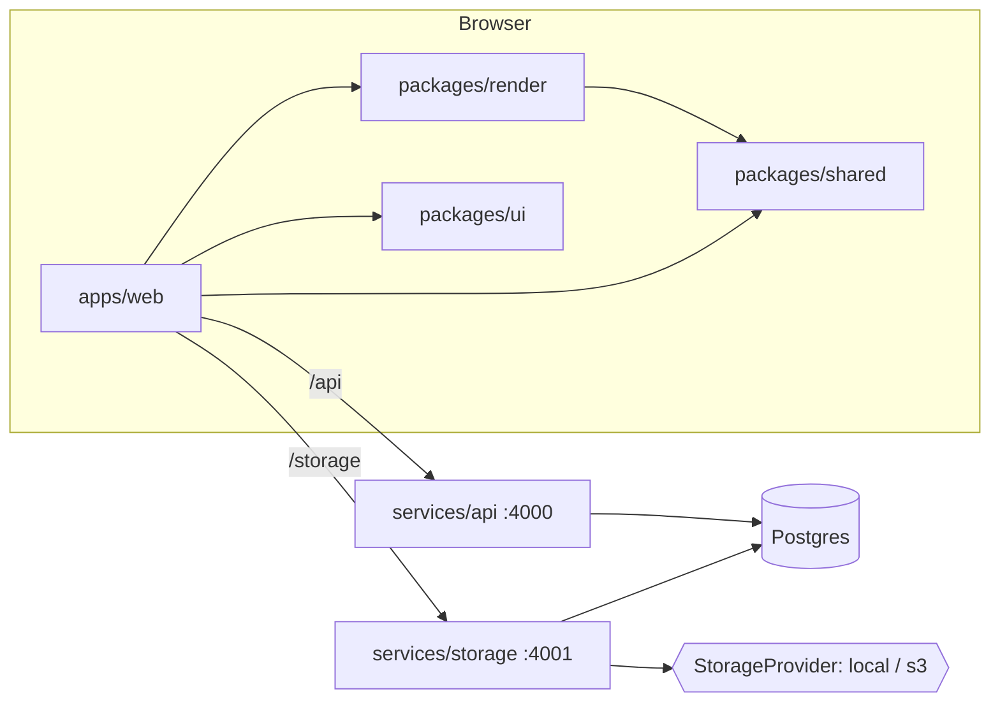

# memegen — architecture

Online meme generator: pick a template (or add one), overlay (optionally animated) text, publish to a voted gallery.

## Components

```
apps/web            React + Vite SPA: editor, templates, gallery, profiles      (component 3 + 4 UI)
packages/ui         Skinnable React components + design tokens (default/apple/matte/google/studio/spectrum)
packages/render     Browser render engine: decode → composite → encode (TS)   (component 2)
packages/shared     Types, zod schemas, upload limits, animation + text layout (used everywhere)
packages/server-kit Node server plumbing: config, Postgres, migrations, auth (+ users rows), http helpers (idParam, page), asset rows
services/storage    Asset service: pluggable providers (local, s3), probing, caps (component 1)
services/api        Gallery/templates/memes/votes/users/stats                    (component 4)
db/migrations       Plain SQL migrations, applied in filename order
scripts/            dev runner, seed/import
e2e/                Playwright browser specs + fixtures (isolated DB/ports)
```



## Decisions

### Rendering happens in the browser
- Requirement: do as much processing as possible client-side in TS. The server stores, validates, and indexes; it never decodes or encodes frames.
- `packages/render` decodes sources to frames, draws text layers on canvas, and encodes output:
  - image → canvas → PNG/JPEG
  - GIF → `gifuct-js` decode (with disposal compositing) → `gifenc` encode, original per-frame delays preserved. Delays under 20 ms play as 100 ms like in browsers; render and storage's duration math share `gifFrameDelayMs` from `packages/shared`.
  - MP4/MOV → `mediabunny` (WebCodecs) demux/decode, per-frame canvas composite, H.264 MP4 encode; audio is passed through
- The editor preview and the exporter call the same `layoutText`/`drawText` (`packages/shared/src/text.ts`), so preview == output. `composeFrame` lays each layer out once and returns its `LayerBox`es (one per visible layer, even transparent/empty ones), which the editor uses for hit-testing.
- Resolution: text is rasterized at the size it is shown or saved, never at the source's pixel size and then stretched (templates are often 250–700 px). The editor canvas's backing store is its CSS size × `devicePixelRatio`; still exports render at least `STILL_EXPORT_MIN_EDGE` (1200 px) on the long edge, capped by the image upload cap (`stillExportSize`), with the source image upscaled at high smoothing quality. Layout is in fractions, so every size draws the same composition; only the min-font clamp (`MIN_FONT_PX`) can differ for overflowing text. GIFs and videos export at native size (frame and file-size caps).
- Trade-off: export speed depends on the client device and WebCodecs support (Chromium, Safari 17+ / Firefox 130+). A server-side fallback can reuse the same TS code later (e.g. node canvas) without changing the data model.

### Layer model (text model ideas taken from jacebrowning/memegen)
- `Layer` is a union tagged by `type` (`layerSchema`, a zod discriminated union): `text` (`TextLayer`) or `image` (`ImageLayer`). Both share `id`, `name`, `angle`, the anchor `x,y`, `opacity`, the visibility window, and keyframes, so placement, dragging, the Animation panel, tracks, and every `animation.ts` rule (generic over `AnimatedLayer`) apply to both. `type` is required; migration 011 tagged every layer stored before images existed as `text`. The types are derived from their zod schemas (`z.output`), so the API boundary and the editor cannot drift.
- A `TextLayer` is a box: center anchor `x,y` + `maxWidth,maxHeight` as fractions of the media size. `fontSize` is a *max*; text wraps at the box width and shrinks until it fits (jacebrowning's fit-to-box behavior).
- An `ImageLayer` draws a still image asset (`assetId`) centered on its anchor, `width` (fraction of media width, up to 2) wide and as tall as the image's own aspect ratio makes it; it is never cropped or stretched. Images are added with the Image button in the Layers panel or by pasting an image anywhere in the editor (a document `paste` listener takes clipboard image files; text pastes are left alone). Either way the file is pre-checked against the image caps (GIFs and videos are refused: image layers are stills), uploaded, and added centered at its native width relative to the media, capped at half the media's width. Its card shows a thumbnail instead of a text box; its settings are width, rotation, placement, and (GIF/video) animation.
- Drawing: `drawLayers`/`composeFrame`/`exportMeme` take the decoded images (`LayerImages`, by asset id) next to the layers; `ensureLayerImages`/`loadLayerImage` fetch and decode each asset once per page (asset content is immutable). An image still loading draws nothing but keeps a box, so it stays selectable. The API rejects image layers whose asset is missing or not a still image (memes and template defaults alike), and storage refuses to delete an asset an image layer references (409).
- Stickers are a shared library of small PNGs (`stickers(name, asset_id unique, owner_id)`, migration 012) that anyone can drop on a meme. "+ Sticker" in the New template card on `/create` pre-checks the file (`precheckSticker`), uploads it, and `POST /api/stickers` makes it a sticker; the Sticker button in the Layers panel opens a picker (`StickerPicker`, a `Dialog` that reloads the library on every opening) and adds the chosen one as an ordinary `ImageLayer` on the sticker's asset, named after the sticker and sized like an added image. Layers reference the asset, not the sticker, so the layer model, drawing, and the API's layer checks are unchanged. The rule (PNG for transparency, at most `STICKER_MAX_DIMENSION` = 512 px on each edge) is a product rule rather than an upload cap, so it is a constant in `packages/shared/src/limits.ts` (`stickerViolations`, shared by the client pre-check and the API) with no env override; the asset must also be the caller's own upload. Stickers without an owner belong to `memegen` (the templates' default-owner trigger), and storage refuses to delete a sticker's asset (409).
- Built-in stickers are dev-only: `SEED_STICKERS_FROM` (`demo/stickers` in `config/dev.env`, gitignored like the rest of `demo/`) is a folder of PNGs that `run.sh seed` imports with `scripts/seed-stickers.ts` (idempotent: assets by sha256, stickers by asset); a missing folder is skipped, and prod refuses the setting.
- Sticker usage mirrors template usage: `sticker_uses` (migration 013) is an append-only log with a `created` row when a saved meme first carries a sticker (an image layer on the sticker's asset) and a `posted` row when a meme carrying it is posted. A trigger on `memes` (insert, and updates of `layers` or `posted_at`) writes it, so every write path counts, and a sticker added to an already posted meme gets its `posted` row then. Each meme counts once per sticker and kind however often it places that sticker (unique `(sticker_id, meme_id, kind)`), re-saving the same layers adds nothing, and removing a sticker keeps its history. Placing a sticker in the editor records nothing until the meme is saved, so abandoned edits don't count. `Sticker.useCount` is all-time posts and `savedCount` all-time saves; `GET /api/stickers` ranks by posts, then saves, then newest, so popular stickers lead the picker, which shows each one's `n🔥`.
- Top section (caption memes): a toggle in the Layers panel adds a white band above the media holding its own text layer, black Arial (`TOP_SECTION_FONT_FAMILY` when `fontAssetId` is null), no outline, as typed. It lives entirely in the layers: the one `TextLayer` with `topSection: {height}` (`layersSchema` allows one) is the band, so memes and template defaults store it in their existing `layers` JSON with no new column, API field, or migration, and toggling off just removes that layer. `height` is the band for one line of text (fraction of the media width, `TOP_SECTION_HEIGHT_MIN..MAX` = 0.1..1, default 0.2) and the text's font size is a fraction of that one-line height (default 0.15), so it never depends on the band it sizes. The text wraps at its box width and never shrinks for height; each line past the first makes the band that much taller (`layoutTopSection`), so the padding around the text stays fixed. Its x/y are fractions of the actual band; every other layer stays a fraction of the media, so switching the band on or off never moves them. Because the band depends on how the text wraps, its height is measured: `packages/shared/src/section.ts` takes a `TextContext` (`topSectionPx`, even so H.264 accepts the frame; `composedHeight`; `layerArea`), and `canvasHeight` in `packages/render` measures with a cached offscreen canvas for the stage, the GIF/video preview, and every export (still, GIF, MP4), which all grow by the band alike. The editor keeps it as layer 0: it can't be reordered, nothing moves above it, and unnamed layers keep their "Text N" numbers. GIF/video outputs still go through the upload caps, so a band that pushes the longest edge past the cap is refused on save.
- `textStyle`: `upper | lower | none | mock` (deterministic sPoNgEbOb casing).
- `angle` rotates the box around its center.
- Stroke width is a fraction of font size, so it scales with the media.
- Everything is resolution-independent (fractions of width/height), so the editor can preview at any zoom.
- `name` (optional, ≤ `LAYER_NAME_MAX_LENGTH`) labels a box in the editor ("Top text", "Panel 1") and is never drawn. Only the Template Editor (new or edited template) renames boxes, so a template's `defaultLayers` carry names that every meme made from it shows; the top/bottom preset is named "Top text"/"Bottom text" and the Text button names the new box "Text N". Optional because layers stored before it have none; the editor labels those "Text N" by position.
- The Layers panel has one row of actions under its heading: the add buttons, labelled just Text, Image, and Sticker (a `role="group"` named "Add layer" gives assistive tech the verb), then the Top section toggle (`aria-pressed`). The row wraps only when the column is too narrow.
- Layer panel (every media kind): each layer is an inset card whose head row holds its name (a name field in the Template Editor), an "anim" badge once it has keyframes, and its actions (settings, reorder, remove) at the top right, so they stay visible while typing. Below is a full-width one-line text box; every text box is editable at once, and focusing one selects that layer on the stage and timeline and grows it to two lines. For GIF/video the selected layer's card also shows its window as "Frame [first] to [last] of N" under the text, keyed on selection rather than focus so clicking into those fields can't hide them; the row is `WindowFields`, shared with the Animation panel, and hides while that panel is open. The pencil opens that layer's other settings inside its card, one card at a time: font, size, colors, case, layout, placement, and for GIF/video the Animation panel (window and keyframes at the current frame).

### Animation
- Per-layer visibility window `start/end` (seconds, null = unbounded).
- Per-layer `keyframes[] {t, x, y, opacity}`; linear interpolation, clamped at the ends (`packages/shared/src/animation.ts`). Empty keyframes = fixed layer.
- The editor shows every decoded frame on a timeline; "set keyframe" stores the current frame's timestamp, which is how per-frame placement works.
- The window is edited in frames, not seconds (`windowFrames.ts`: `windowFrames`, `clampEdgeFrame`, `setEdgeFrame`, shared by the tracks and the frame fields). A layer shows from its first frame's start through its last frame's whole duration: `end` stores the last shown frame's start time, matching `isVisibleAt`. The clip's first/last frame stores `null` ("from the start"/"until the end"), and an edge is clamped so the window can't invert. The frame fields are 1-based number inputs that keep a draft while typing (so they can be cleared and retyped); a whole number in range applies at once and seeks there, and leaving the field shows the stored, clamped value.
- Under the frames, `LayerTracks` gives every layer its own line, laid out on the frame strip's own cells inside the same horizontal scroller, so each track locks to the frames it marks and scrolls with them. A track's bar spans the cells of its first through last frame and carries the layer's text (first line, clipped; `layerLabel` when empty); there is no separate name column. Its ends are drag handles (`role="slider"`, arrows/Home/End step a frame) that snap to cell edges: the start to a frame's left edge, the end to a frame's right edge. The cell geometry (thumbnail border and gap) is defined once in `Timeline.tsx` and handed to both the CSS (custom properties) and `LayerTracks`. Dragging selects the layer and seeks to the edge's frame, so the stage previews it.
- For GIF/video the editor's side column has a **Preview** card between Layers and Save (`PreviewPanel`): its button ("Preview GIF"/"Preview video", then "Hide preview") plays the whole meme on a loop in real time with the export's compositor (`composeFrame`), each frame shown for its own duration and the layers evaluated at the frame's start time, exactly as the GIF/MP4 export does. The canvas fills the card's width at the media's aspect ratio. Frames that decode too slowly are skipped rather than slowing the clock, so the timing stays true. It reads the latest layers on every frame, so edits show while it plays and no manual refresh is needed. Unlike the stage's Play, it has no selection handles and uses the export's timing.
- Every layer edit rule lives in `animation.ts` as a pure `TextLayer → TextLayer` function, and the editor only applies them: `placeAt` (static layers move their anchor, animated layers get a keyframe at the current time; x/y clamped to -0.5..1.5 by `clampAnchor`, for dragging and the X/Y fields alike), `addKeyframeAt`, `removeKeyframe` (removing the last keyframe keeps its state as the static position), `clearAnimation` and `setWindow` (an edge that would invert the window clears the other edge).

### Storage (component 1)
- `StorageProvider` interface (`put/get(range?)/delete`) with a factory table keyed by name (`providers/registry.ts`). Built-ins: `local` (filesystem) and `s3` (AWS SDK v3, works with any S3-compatible endpoint). A new provider is one entry in that table; no other code changes.
- Each asset row records its `provider` + `storage_key`, so several providers can coexist and the default (`STORAGE_PROVIDER`) can change without migrating old files.
- Asset kinds: `image | gif | video | font`. Content type is sniffed from magic bytes, not trusted from the client. `SUPPORTED_TYPES` in `packages/shared` is the one list of accepted mime/extension pairs; the web `accept` strings, mime→extension lookup and the 415 message are built from it.
- Content is served with HTTP Range support (video scrubbing). A row whose bytes are missing from its provider answers 404, not 500.
- The `assets` row type and its `Asset` mapping (`AssetRow`, `toAsset`, `findAssetRow`) live in `packages/server-kit`, so the API reads asset rows without importing the storage service.

### Upload caps
Enforced server-side on every upload (client pre-checks with the same `limitViolations` from `packages/shared`). Defaults, env-overridable:

| kind  | max longest edge | max frames | env |
|-------|------------------|------------|-----|
| any   | 20 MB file size  | —          | `MAX_UPLOAD_BYTES` |
| image | 4096 px          | —          | `MAX_IMAGE_DIMENSION` |
| gif   | 1024 px          | 500        | `MAX_GIF_DIMENSION`, `MAX_GIF_FRAMES` |
| video | 1920 px          | 1800       | `MAX_VIDEO_DIMENSION`, `MAX_VIDEO_FRAMES` |

Probing is pure JS (no ffmpeg on the server): `image-size` for still images, a GIF block walker for frame count/duration, `mediabunny` for MP4/MOV dimensions, duration, and frame count.
Rendered outputs go through the same caps, so an export over 20 MB is rejected.

### Templates
- `templates` with a nullable `parent_id`: exactly one level of hierarchy (template → variations). A DB trigger rejects a variation whose parent is itself a variation, and rejects giving a parent to a template that already has variations.
- Templates carry `default_layers` (text box presets) that seed the editor.
- Every template has an author (`owner_id not null`, shown as "added by"). Built-in templates belong to the reserved `memegen` account: a trigger fills a null owner with `memegen_user_id()` (created lazily, so seeds and `on delete set null` keep working), and `sessionSchema` refuses `memegen` as a login name, so nobody can act as it or edit its templates.
- `scripts/seed.ts --from <jacebrowning/memegen clone>` imports its fonts and ~200 templates. `default.*` becomes the parent; other images in the folder become variations.
- Every template has a `kind`, fixed when it is created, and each kind has its own editor: `single` (one still image, text boxes), `gif` (a GIF or video, animated text boxes and timeline), `multi` (multi-panel, image pack). It is a stored column (`templates.kind`, migration 010), not derived per request: a `before insert` trigger classifies every new row from what it is made of (`panels` set → `multi`, else its asset's kind), so the API, seeds, and scripts all agree, and it never re-runs on update (a multi-panel template's cover image is replaced on edit but it stays `multi`). The editor routes on it: `multi` opens `PanelWorkspace`, the others the media editor.
- The template browser lives on `/create`; there is no separate templates page. The start view puts hot templates beside the "New template" card (the only way to bring in new media), with all templates and their search below. "All templates" has a kind filter on its heading row (All / Single / Multi-panel / GIF, where GIF includes videos), sent as `?kind=`; the heading row and search share the search's width, so the filter ends at the search box's right edge rather than the page's. The template grid loads the next page when an IntersectionObserver sentinel nears the viewport; the sentinel re-arms after each page, so short pages keep loading. The grid's `data-query` and `data-kind` name the search and filter it shows, since the search is debounced.
- Adding a template: the file is pre-checked and uploaded, then the main editor opens as the "Template Editor" (`/create?newTemplate=<assetId>`) with TOP TEXT / BOTTOM TEXT boxes placed. The user edits boxes like any meme, names and tags it, and Save template asks "Add new template?" (`Dialog` in `@memegen/ui`, a native `<dialog>`) before `POST /api/templates` with the placed boxes as `defaultLayers` and the tags as base tags; the new template then opens in the editor. Abandoning the editor leaves the uploaded asset unused.
- Template cards (all templates, tag pages) show only the image, name, author, use count (`n🔥`), and Use. Opening a template in the editor shows its details under the stage: tags (base tags marked; any signed-in user can add more), the usage chart, and its variations. Variations are created through the API (`POST /api/templates` with `parentId`); the UI has no upload for them.
- Profiles have a Templates tab (public, beside Memes) listing the templates the user added, variations included, newest first (`GET /api/users/:username/templates`; private ones only for their owner). On your own profile each card shows Edit instead of Use and opens the template editor (`/create?editTemplate=<id>`): the stored default boxes load as they are (ids kept, an empty list stays empty), and Save changes sends `PATCH /api/templates/:id` with the name and `defaultLayers`. Memes already made from the template keep their own layers. Tags and visibility are not edited there; base tags have no removal path.

### Multi-panel templates (expanding brain, panik kalm mememan, Mr. Incredible becoming uncanny)
- A second kind of template: instead of one media file with text boxes, an **image pack** (still images, typically JPEGs) and default **panels**. `Template.panels` is `{layout, grid, fontSize, pack: Asset[], defaultPanels}` (null for media templates, whose `defaultLayers` they have instead; a multi-panel template's `defaultLayers` is empty). A meme made from one stores `Meme.panels = {layout, grid, fontSize, panels}` with `layers: []`; each panel is `{id, assetId, text}`, its image a reference into the template's pack.
- Layout: `vertical` stacks rows of [caption | image]; `horizontal` lines up columns of caption over image. A meme has 1..`MAX_PANELS` (12) panels and may change the layout, add, remove, and reorder panels, and point each one at any pack image. New panels continue through the pack (the next image after the last panel's), which is how expanding-brain memes grow.
- Pack images are references, never edited: no crop, resize, or placement controls. Each image is drawn whole at its own aspect ratio, only scaled so every image in the strip shares one width (vertical) or height (horizontal); a panel's row or column takes its image's shape. Changing a panel's image changes only its reference. Captions are black, unstroked, as typed, in the fallback font, and fit their cell with the shared `layoutText`/`drawText`.
- Style is per set, not per panel, so captions stay uniform: `grid` (default on) draws black rules around every caption and image; `fontSize` (one "Text size" slider, `PANEL_FONT_SIZE_MIN`..`MAX` = 0.03..0.3, default 0.1) is the max caption height in units (an image's width in vertical layouts, its height in horizontal ones), and captions still shrink to fit. Both default when omitted; migration 009 gave panels saved before them `grid: true, fontSize: 0.16`, the look they were drawn with.
- Geometry (`panelGrid`, `panelExportSize`, `panelTextLayer` in `packages/shared/src/panels.ts`) and drawing (`composePanels`/`exportPanels` in `packages/render`) are shared by the editor stage and the export, so preview == output. Exports are JPEG at `PANEL_EXPORT_UNIT` (600) px per image width/height, shrunk to keep the long edge under the image cap.
- The template's `asset` is a cover rendered client-side from its default panels and uploaded like a meme output, so template cards, `Meme.sourceAsset`, and everything else that shows a template image needs no special case. Editing the defaults re-renders and replaces the cover (`PATCH` takes `panels` and `assetId` together).
- The pack lives in `template_pack_assets(template_id, asset_id, position)` (FK, so storage refuses to delete a pack image with 409). Packs only grow once saved: `PATCH` rejects dropping an image, because memes reference pack images by id. The API checks every meme panel's `assetId` against its template's pack, requires panels for multi-panel templates, and rejects them for media templates.
- Authoring: "Multi-panel template" on `/create` opens `/create?newPanels`, where the Image pack panel uploads images (pre-checked against the image caps; still images only, up to `MAX_PACK_IMAGES` = 24) and the first upload starts one panel per image. Unsaved images can be removed unless a panel shows them. While authoring (new or edited template) the panel list is headed "Default Setup", since its layout and panels become the template's defaults; making a meme it is "Panels". `?template=`, `?editTemplate=` and `?meme=` open this editor (`PanelWorkspace`) whenever the template has panels; `useEditorSession` decodes the pack images instead of media.

### Template usage ("hot" templates)
- Core tables: `users`, `memes` (one row per meme, with its own vote tallies), `templates` (+ variations), `votes`, `assets`.
- `template_uses` is an append-only event log: a `created` row when a meme is made from a template, a `posted` row when it is posted. Each row stores the exact template and its `root_template_id` (the parent for variations), so a variation's usage also counts toward its parent.
- Written by a trigger on `memes`, so every write path records usage. `meme_id` is `on delete set null`: history survives meme deletion and still feeds "hot over time". Migration 007 backfilled the uses of memes 006 reassigned with a plain UPDATE (which the trigger doesn't see).
- Hot ranking = `created` uses inside the period (tie-break: posts). `Template.useCount` is the all-time count; `/usage` gives a time series for charts.

### Tags
- `tags(slug unique, name, kind topic|team, description)` + join tables `template_tags`, `meme_tags`. Built-in topics: `oldschool` (all seeded jacebrowning templates), `movie` (screenshots). `team` tags mark an org's own memes (e.g. `google-memes`) when deployed internally.
- Names normalize to slugs (`"Google Memes!"` → `google-memes`, `tagSlug` in shared). Tagging with an unknown slug creates a `topic` tag; `POST /api/tags` creates one explicitly (e.g. with `kind: team`). In the UI new tags are made while authoring a meme (editor save panel), not from the main page.
- Inheritance (SQL views): `template_tag_matches` rolls variation tags up to the parent; `meme_tag_matches` matches a meme by its own tags **or** its template's/parent's tags. Tagging a template `movie` surfaces every meme made from it. `Template.tags`/`Meme.tags` show only directly placed tags.
- Template tags are base or added (`template_tags.base`, `added_by`). Base tags come with the template (author's tags at creation, seed tags) and are never removed through the API. Any signed-in user can add tags (`POST /api/templates/:id/tags`); additions never touch base tags. `Template.baseTags ⊆ Template.tags`.
- Trade-off: there is no removal path for added tags yet (no moderation); a mistaken tag stays until removed in SQL.
- Meme tags: the meme owner sets them.

### Memes, posting, visibility
- Every meme is made from a template (`memes.template_id not null`, FK `on delete restrict`; `POST /api/memes` takes `templateId` only). There is no one-off upload: new media becomes a template first. Migration 006 gave earlier one-off memes a private template built from their own source image, owned by their author.
- A meme stores its template, the source asset (the template's media at creation), the client-rendered output asset, and the `layers` used, so it can be re-edited.
- Saved = row exists (`posted_at` null). Posted = `posted_at` set. `visibility` is `public` (default) or `private`.
- Gallery and public profiles list memes that are posted **and** public ("listed"). Private memes are visible only to their owner and can't be voted on. A meme opened by id is readable when public (drafts included) or owned by the viewer.
- These rules live once in `services/api/src/rows.ts` as SQL fragments (`memeListed`, `memeVisibleTo`, `memeOpenTo`, `templateVisibleTo`) plus `requireListed` for loaded rows (votes, favorites, comments).
- Meme feeds flow in justified rows, not a grid: media at native aspect, never cropped, widths vary. `justifyRows` (`apps/web/src/components/memes.tsx`) splits the memes into rows that exactly fill the measured width, each as close as possible to the target `--meme-row-height`, breaking a row before or after the item that crosses the target, whichever lands nearer. The target is 250px in every skin except Spectrum (270px); it is its own token rather than derived from `--ui-grid-min`, so a skin with dense template tiles (Google) still gets full-size memes. The last row stays at the target height, left-aligned. Rows can shrink as well as grow, which pure-CSS flex-grow rows can't; that is why this is JS (a ResizeObserver re-runs it on resize). Every skin uses it, including Studio, whose generic masonry columns still apply to other media grids.
- Grid cards shrink to their image; title, author, votes, star and comment count sit on a scrim (`--ui-color-scrim` / `--ui-color-on-scrim`, dark in every skin) that fades in from the bottom and slides up on hover or keyboard focus. Devices without hover (`@media (hover: none)`) always show it. The overlay stays in the DOM (opacity, not `display`), so it remains reachable by keyboard and automation. Tags are left off the overlay (they crowded small cards); they show on the meme's own page.

### API code layout (`services/api`)
- `app.ts` only wires auth middleware, the error handler, and `routes/{users,templates,tags,memes,comments,gallery,stickers}.ts`, each exporting `register(app, sql)`.
- `access.ts` holds the loaders/guards routes share (`requireUser`, `loadMeme`, `loadTemplate`, `ownMeme`, `ownTemplate`, `requireMediaAsset`, ...), each a plain `(sql, …)` function.
- `rows.ts` holds row types, base selects (`memeSelect` exposes aliases `m`, `u`, `v`; callers may append joins), `toX` mappers, and `withVariations`/`nest`, which load children for a whole page in one query (template lists, hot templates, comment replies).
- Query/body schemas come from `@memegen/shared`; `idParam`, `page()`, `UserRow`/`toUser`, and `AssetRow`/`toAsset`/`findAssetRow` from `@memegen/server-kit`, so the API never imports the storage service.

### Web app code layout (`apps/web`)
- `pages/` are route screens only; they import from `components/`, never from each other, and components never import pages. The feed model (period/sort labels, feed kinds, URL filters, `GalleryFilters`, `GalleryFeed`) lives in `components/feed.tsx`; `GalleryFilters` decides itself whether the skin puts it at the requested placement.
- Data loading goes through three hooks: `useAsync(key, load)` for one value (a key change hides the old value at once and drops late results; `keepStale` keeps it on screen for background refreshes like the tag sidebar), `usePaged` for offset lists (`replace(item)` swaps in an updated item by id), and `useAction()` for mutations (busy/error, no state updates after unmount).
- Paging: a list that ends the page loads its next page from an IntersectionObserver sentinel (the template browser). Lists with content after them (tag-page templates, comments) and meme feeds use a "Load more" button; the e2e `loadAll` helper drives the feeds' `load-more` button.

### Votes, ranking, stats
- `votes(user_id, meme_id, value ±1, created_at)`, one per user per meme. A trigger keeps `memes.upvotes/downvotes` up to date; `score` is a generated column.
- Votes double as per-user activity (no separate store): `GET /api/me/activity` lists every meme the viewer voted on, likes and dislikes together (`myVote` says which), newest vote first (`votes_user_time` index; changing a vote refreshes `created_at`, clearing it deletes the row). Only the owner sees it: the profile's "Recent activity" tab.
- Favorites are separate from votes: `favorites(user_id, meme_id, created_at)`; the ☆/★ button stars other users' posted public memes (`Meme.favorited` is per viewer). `GET /api/me/favorites` backs the owner-only profile "Favorites" tab, most recently starred first. Profile tabs: Memes, Favorites, Recent activity.
- Gallery: Popular (`/`, `best`) = posted public memes with `posted_at` inside the period (day/week/month/year/all), ordered by score, then recency. Recent (`/recent`, `new`) = all-time recency. Tag pages keep both sorts.
- User stats are computed over posted memes:
  - `memeCount`
  - `highScore`: max score
  - `hScore`: largest h such that h memes have score ≥ h
  - `negativeHScore` (internal only): largest h such that h memes have score ≤ −h. Exposed only at `/internal/users/:username/stats` on the API port, behind `X-Internal-Token`; the web proxy does not forward `/internal`.
- One SQL definition of the stats serves profiles and the leaderboard (`/api/leaderboard?by=hScore|highScore|memeCount`, users with ≥ 1 posted meme).

### Badges
- Config in `packages/shared/src/badges.ts`: each badge has an emoji `icon`, a label, and `show(stats)`. Profiles render `badgesFor(stats)`; adding a badge is one config entry, no API change.
- Tiers bronze 🥉 / silver 🥈 / gold 🥇 / platinum 🏆 / diamond 💎 for memes posted (3/10/25/50/100), high score (10/25/50/100/250), and h-score (2/5/10/20/30). A tier shows while the stat is in [its threshold, the next tier's), so each stat shows only its highest tier.
- Computed client-side from public stats, so badges can never leak internal stats.

### Comments
- `comments(meme_id, parent_id, author_id, body, deleted_at)`: top-level comments plus one level of replies (a trigger requires a reply's parent to be a top-level comment on the same meme), like Google Memegen's per-meme discussion.
- Only posted public memes take comments (same rule as votes); reading follows meme visibility.
- Deleting a comment that has replies blanks it (`deleted_at`, returned as `deleted: true`, empty body) so the thread keeps its shape; otherwise the row goes, and a blanked parent left without replies goes with it. `Meme.commentCount` counts non-deleted comments.

### Auth (placeholder)
- No passwords yet. `POST /api/session {username}` finds or creates the user; the client sends `X-User-Id` on requests.
- The web app is sign-in only: with no stored user, `App.tsx` renders the sign-in page (`pages/SignIn.tsx`) at every URL instead of the shell, and signing in renders the app at that same URL (no redirect, so deep links survive). Pages and components therefore always have a user (`useUser()`, non-null) and carry no signed-out branches. The API still serves anonymous reads; the gate is a UI decision, not an access rule.
- The sign-in page follows the config's `MODE`, which Vite bakes in as `__MEMEGEN_MODE__` (`apps/web/src/mode.ts`, `DEV_MODE`). A build without `MODE=dev` (e.g. a bare `vite build`) is prod, so the dev login never ships by accident; Playwright pins `MODE=dev` for its Vite server. Dev shows the username login; prod shows a "Sign in with SSO" placeholder that only alerts, so a prod build has no way to sign in until a real provider exists. This is UI only: `POST /api/session` still accepts any username in either mode.
- The client keeps the user in a `memegen.user` cookie (JSON, `max-age` one year, `path=/`, `SameSite=Lax`) so the login survives restarts until sign-out. The cookie is client storage only: the server never reads it, and identity still travels as `X-User-Id` through `HeaderAuthProvider`.
- The client drops the cookie when the API answers 401 to a request that carried `X-User-Id` (the user no longer exists, e.g. after `./run.sh config/dev.env reset`), which shows the sign-in page again instead of failing every request.
- Behind an `AuthProvider` interface (`packages/server-kit/src/auth.ts`); a real provider (OAuth/session) replaces `HeaderAuthProvider` without touching route code.
- **Not secure**: anyone can act as anyone. Fine for local development only.

### UI skins (`packages/ui`)
- All web UI goes through `@memegen/ui`: typed React components that extend native element props and render native controls (`<select>`, `<input type=file|range|color>`), so platform behavior, a11y and automation work identically in every skin.
- A skin is `data-skin="<id>"` on `<html>` plus CSS: `tokens.css` holds the default (dark) token set on `:root`; `skins/<id>.css` overrides tokens and adds component tweaks under `:root[data-skin="<id>"]`. Components and `apps/web/src/styles.css` read only tokens (no hard-coded colors). Derived roles (link, focus ring, slider thumb from primary; separator and slider track from border; input background from bg; on-tonal from text) default to `var()` of their source, so a skin overrides them only when they differ.
- Boundary: `packages/ui` skins style only `.ui-*` classes. App widgets that need a particular look use UI primitives: `Button tone` (a pressed upvote/favorite keeps its warning/info color), `Panel variant="flush"` (the timeline), `--ui-panel-padding`.
- Built-ins: `default`, `apple` (HIG, light only), `matte` (M3-inspired), `google` (2012 internal Memegen / Kennedy), `studio` (a light creative-studio look; formerly called "spectrum" though it used none of Spectrum's CSS), `spectrum` (real Spectrum 2 via `@spectrum-css/tokens`, styled like Firefly, dark), `painted` (Spectrum 2 light over a fixed watercolor wash, painted-ink wordmark). `matte` and `studio` follow `prefers-color-scheme`.
- `painted` is a light variant of `spectrum`, not a copy: `spectrum.css` selectors are `:root:is([data-skin="spectrum"], [data-skin="painted"])` (same specificity as a single attribute), `painted`'s `rootClassName` swaps `spectrum--dark` for `spectrum--light` so the shared token mapping resolves to light values, and `painted.css` (imported after) overrides the backdrop, header, surfaces, buttons, and wordmark. The page background under the wash stays Spectrum `gray-100`, but every surface Spectrum paints light gray is translucent white instead (main content area 20%, so it reads apart from the 50% header; panels, cards, and sheets 50%; fills on sheets 70%; fields and nested panels 75%; hover and dialogs 90%), so the wash tints the UI; Spectrum sets several of those grays directly in rules rather than tokens, so `painted.css` restates each one. The header is always 50% white with a backdrop blur over whatever scrolls under it.
- `Skin.rootClassName` adds classes to `<html>` while a skin is active, for design-system CSS that scopes tokens to classes (Spectrum's `.spectrum--dark` etc.), so those tokens never reach other skins.
- Adobe Clean (Spectrum's typeface) is licensed through Adobe Fonts only, so it is never bundled or hot-linked; the `spectrum` stack uses it when installed and otherwise the bundled Source Sans 3 (OFL), Spectrum's documented fallback.
- Radlush Extra Bold (`painted`'s wordmark face; Arterfak Project, commercial, embedding restricted) is never bundled or committed. A `local()` `@font-face` named `Radlush` matches it by PostScript/full name when installed (the file's legacy family name is "Unnamed ExtBd", so `font-family: Radlush` alone wouldn't); without it the wordmark falls back to the bundled Archivo at 900 (OFL).
- `useSkinFavicon` draws the wordmark's first letter on a canvas (canvas, not SVG, so it can use the page's web fonts) in the skin's wordmark font, case, and color or gradient over its page background, and swaps the `<link rel="icon">`. `apps/web/public/favicon.svg` covers the first paint.
- `SkinProvider` picks `?skin=` → `localStorage["memegen.skin"]` → `fallback` and persists changes, unless `locked` pins one skin (no URL/storage lookup, no persistence, `setSkin` ignored).
- In prod the web app is locked to `default` (`SkinProvider locked`): one look, no switcher, `?skin=` ignored. In dev the provider is unlocked (`?skin=` → storage → `default`) and the sign-in page has a fixed bottom-left "Dev tools" panel with `SkinSwitcher`, so skins can be previewed; the app has no switcher once signed in. App-side per-skin CSS was removed and e2e runs one project in the default skin.
- Skins can replace any component (`Skin.components`, typed by `ComponentOverrides`) and give one layout hint, `Skin.layout.filters`: sort/period in the sidebar or beside the page title. The hint moves the controls (`GalleryFilters` renders only at its skin's placement); it never duplicates them, so test ids stay unique.
- Trade-off: the hint means the app branches on skin in one place; in exchange CSS-only skins can still look structurally like their design systems.

### Testing
- `node --test` (`bun run test`): pure logic in `packages/shared` (interpolation, limits, fit-to-box layout) plus storage/API behavior through `app.request()` against a fresh `memegen_test` schema (caps, ranges, stats, hierarchy, visibility, votes, usage, tags).
- Playwright (`bun run test:e2e`): full browser flows against real servers on separate ports and a fresh `memegen_e2e` DB. Exported files are checked with `ffprobe` (frame counts, audio passthrough). Uses branded Chrome, since Playwright's Chromium lacks H.264/AAC for WebCodecs.
- Mock dataset (`scripts/mock/data.ts`, written by `seed-data.ts`): e2e only. Deterministic users, templates, memes backdated across periods, and votes, with expected stats and orderings exported for specs. Rankings and stats in `MOCK_EXPECT` are hand-written as an independent oracle; facts like which memes are hidden are derived from `MOCK_MEMES`. e2e setup loads it into `memegen_e2e`. Media is generated in code. Both seed paths share their template SQL (`scripts/lib.ts`) and build the asset store with `assetStoreFromEnv`.
- Sample dataset (`scripts/sample/data.ts`, written by `scripts/sample/seed.ts`): the dev DB's content, so dev looks like a real site instead of placeholders. It is committed as code, not as a DB dump: dumps go stale with every migration and can't carry media, while the fixture refers to templates by slug and survives schema changes. Memes are made from the jacebrowning templates (`SEED_TEMPLATES_FROM`, imported first). Their images are rendered at seed time by `@memegen/render` (the editor's export path) in Playwright's headless Chromium. The page and every asset it loads are served from the asset store through `page.route`, so seeding needs no running services and no network. Rendering happens before any DB write, so a browser failure leaves the DB untouched. `./run.sh config/dev.env seed` loads it (`SEED_SAMPLE=true`; refused in prod); `reset` (dev only) drops the schema and local storage, then seeds again.
- Starter dataset (`scripts/starter/data.ts`, written by `scripts/starter/seed.ts`): work-appropriate example memes for a new deployment, all owned by the reserved `memegen` account, with no other users, votes, or comments. Code, like the sample dataset, so its text is reviewed in PRs. Both datasets render through `scripts/render/` (`render-memes.ts` + the browser entry `render-page.ts`). `config/starter.env` builds it in its own database and storage (`SEED_STARTER=true`), and it ships as a snapshot (see "Snapshots").
- e2e specs reuse contracts instead of copying them: expected slugs come from `tagSlug`. API setup goes through `apiPost`/`apiTemplate`/`apiMeme` in `e2e/helpers.ts`.
- Every spec signs in first (`signIn` drives the sign-in page). Identities are suffixed with the project name (`scoped()`), and vote assertions are relative to what's shown, so specs share one seeded DB.
- The UI exposes `data-testid` hooks plus readiness markers (`stage-canvas[data-ready]`, `timeline[data-complete]`), so specs wait on state rather than sleeps.
- Vite pre-bundles the linked render package's deps (`optimizeDeps.include`); otherwise the first editor load triggers a dep re-optimization reload.

### Snapshots (backup, seed data)
- One format serves every workflow: a real backup of prod, the sample dev data, and the starter content. A snapshot is one zip saved and loaded by `scripts/snapshot.ts` (`./run.sh <config> snapshot save|load`):
  - `manifest.json`: format version, label, source (mode, database, git commit, Postgres version), the applied migrations, every table's row count, and every file's path, size, and sha256
  - `db/memegen.dump`: `pg_dump --format=custom --no-owner --no-acl`, schema and data together, including `schema_migrations`
  - `db/schema.sql`: the same schema as plain SQL, for reading a snapshot without restoring it; never loaded
  - `assets/{fonts,stickers,templates,memes,uploads}/<readable-name>--<id8>.<ext>`: every asset's bytes, stored uncompressed so they open directly. An asset is stored once, in the first folder its roles claim in that order (template media, multi-panel covers, and pack images are `templates`; rendered memes are `memes`; image layers and unused uploads are `uploads`). Names come from the template name, `<owner>-<meme title>`, or the sticker/font/asset name; the id prefix keeps them unique, and the full id is used if two still collide. Loads find files through the manifest, never by name.
- A dump, not a row export: replaying rows as inserts would re-fire the triggers that write `template_uses`, `sticker_uses`, vote tallies, `templates.kind`, and template owners, doubling or rewriting derived data. `pg_restore` creates triggers after it loads the data, so derived rows come back exactly as saved.
- Schema versioning is the migration list. A load restores the snapshot's own schema, then runs `migrate`, so an old snapshot is upgraded by the same append-only migrations prod runs on deploy (data migrations included). A snapshot naming a migration the code lacks (newer code) is refused; so is a format other than `SNAPSHOT_FORMAT`, which only changes if the zip layout does. This is why migrations must never be edited once applied.
- Save is read-only and consistent: one `repeatable read` transaction exports a Postgres snapshot (`pg_export_snapshot`), both `pg_dump`s run with `--snapshot`, and the row counts and asset list are read in the same transaction, so a live system saves one moment. Save refuses a database whose migrations don't match the code. Assets stream into the zip one at a time, hashed on the way; if any bytes are missing or don't match their `sha256`, save lists every one and leaves no zip (it writes `<out>.partial` and renames only on success).
- Load only targets a clean system. Clean means no tables, or nothing but what migrations create (no users and no assets, so no content; e.g. right after `setup`), which load resets to an empty schema. Anything else is refused, so a load can never merge into or overwrite real data; in dev, `snapshot load --replace` wipes first, like `reset`. Order: verify every file's sha256 and the migration list before writing anything, upload the bytes to the default provider (keeping each `storage_key`; keys are unique per asset id), `pg_restore --single-transaction`, point every asset row at the default provider (so a local snapshot loads into S3 and back), compare row counts with the manifest, then migrate.
- Snapshots are not committed: they carry media (like `demo/`) and, for backups, all user data. They default to `.data/snapshots/` (gitignored) and are shared out of band.
- Requires the PostgreSQL client tools (`pg_dump`, `pg_restore`) at least as new as the server. Zips are written with `yazl` and read with `yauzl` (streaming, zip64).

### Runtime and tooling
- Servers: Node ≥ 24.2 running `.ts` directly (type stripping; erasable syntax only), Hono + `@hono/node-server`, `postgres` (porsager) client.
- Bun is the package manager/script runner/builder (`bun install`, `bun run …`); Vite builds the web app.
- Postgres for metadata; local disk (`.data/storage`) for files by default.

### Running and configuration
- `run.sh <config> <command>` is the single entry point. A config is a plain `KEY=value` file. `run.sh` exports it literally (no shell expansion), and Node's `--env-file` reads the same format as a fallback.
- `config/dev.env` is committed with no secrets. `config/prod.env` is gitignored and copied from `config/prod.env.example`.
- `MODE=prod` guards:
  - sample seeding, `dev`, `reset`, `test`, `e2e`, and `snapshot load --replace` are refused
  - `INTERNAL_TOKEN` must be set and not the dev value
  - placeholder `DATABASE_URL`s are rejected
  - masked values only in `config` output
- `start` serves the built SPA with `scripts/serve-web.ts`, a dependency-free Node server:
  - SPA fallback; immutable caching for `assets/`
  - proxies `/api` and `/storage` exactly like the Vite dev proxy; `/internal` is never proxied
- One supervisor, `scripts/run.ts` (`--watch`: servers under `node --watch` + Vite; `--prod`: `serve-web.ts`), runs migrations, then storage, API, and web, prefixing each output line with its process. If any process exits (or on Ctrl-C/SIGTERM) the rest stop and it exits with that process's status. `run.sh dev`/`start` and `bun run dev` exec it; the process list lives in `scripts/services.ts`, which Playwright's `webServer` also uses.
- The web proxies default to `http://localhost:${API_PORT}` / `${STORAGE_PORT}`; `API_URL`/`STORAGE_URL` are only overrides for split hosts, so changing a port can't leave a proxy pointing at the old one.
- **UI skins**: see `packages/ui/README.md`. Components read design tokens, and `<html data-skin>` selects default/apple/matte/google/studio/spectrum/painted; a skin can also replace whole components.

## Service contracts

All JSON. Errors: `{ error: string, details?: string[] }` with 4xx/5xx (validation issues or cap violations, human-readable).

### storage (`:4001`, web proxy `/storage`)
| method | path | notes |
|---|---|---|
| GET | `/limits` | `UploadLimits` |
| GET | `/providers` | `{ default, available[] }` |
| POST | `/assets` | multipart `file`, optional `name`; `X-User-Id` sets owner. 201 `Asset`; 413/422 `{error, details: violations[]}` |
| GET | `/assets?kind=&offset=&limit=` | `Page<Asset>` (fonts sorted by name; the editor's font list) |
| GET | `/assets/:id` | `Asset` |
| GET | `/assets/:id/content` | file bytes, Range supported, immutable cache |
| DELETE | `/assets/:id` | owner or internal token; 409 if referenced |

### api (`:4000`, web proxy `/api`)
| method | path | notes |
|---|---|---|
| POST | `/api/session` | `{username}` → `{user}` (find or create); reserved names (`memegen`) → 400 |
| GET | `/api/me` | `UserProfile` `{user, stats, templateCount}`; 401 without user |
| GET | `/api/me/activity?offset=&limit=` | `Page<Meme>` the viewer voted on (either way), newest vote first; 401 without user |
| GET | `/api/me/favorites?offset=&limit=` | `Page<Meme>` the viewer starred, newest first; 401 without user |
| GET | `/api/leaderboard?by=hScore\|highScore\|memeCount&limit=` | `LeaderboardEntry[]` `{rank, user, stats}` |
| GET | `/api/users/:username` | `UserProfile` (public stats; `templateCount` = public templates the user added, variations included) |
| GET | `/api/users/:username/memes` | `Page<Meme>`; the owner also sees drafts/private |
| GET | `/api/users/:username/templates` | `Page<Template>` the user added, variations included (each top-level one with its visible variations nested), newest first; the owner also sees private ones |
| GET | `/api/templates?q=&tag=&kind=&offset=&limit=` | `Page<Template>` (top-level, variations nested; `owner` always set, `baseTags ⊆ tags`); `kind` = `single`, `multi`, or `gif` (GIFs and videos) |
| GET | `/api/templates/hot?period=&limit=` | `HotTemplate[]` — most-used top-level templates in the period |
| GET | `/api/templates/:id/usage?period=` | `TemplateUsage` — zero-filled series (day→hourly, week/month→daily, year/all→monthly) |
| GET | `/api/templates/:id` | `Template` (+ variations, `useCount`) |
| POST | `/api/templates` | `{name, assetId, parentId?, defaultLayers?, panels?, isPublic?, tags?}`; `tags` become base tags; `panels` = `{layout, packAssetIds, defaultPanels}` makes a multi-panel template (still-image pack, `assetId` its rendered cover, no `defaultLayers`) |
| PATCH/DELETE | `/api/templates/:id` | owner only; PATCH `{name?, defaultLayers?, isPublic?, panels?+assetId?}` (multi-panel: new defaults with their re-rendered cover; pack images can be added, not removed); DELETE → 409 while memes use it (or one of its variations) |
| POST | `/api/memes` | `{title, templateId, outputAssetId, layers, panels?, visibility, post, tags?}`; every meme is made from a template; `panels` (`{layout, panels}`, images from the template's pack) is required for multi-panel templates and rejected otherwise |
| GET | `/api/memes/:id` | `Meme` (private → owner only) |
| PATCH | `/api/memes/:id` | `{title?, visibility?, tags?, layers+outputAssetId(+panels)?}` owner only |
| POST | `/api/memes/:id/post` | sets `posted_at` |
| DELETE | `/api/memes/:id` | owner only |
| PUT | `/api/memes/:id/vote` | `{value: -1|0|1}` → `Meme` |
| PUT | `/api/memes/:id/favorite` | `{favorite: boolean}` → `Meme`; posted public memes only; idempotent |
| GET | `/api/memes/:id/comments?offset=&limit=` | `Page<Comment>`: top-level oldest first, replies nested |
| POST | `/api/memes/:id/comments` | `{body, parentId?}` → 201 `Comment`; posted public memes only |
| DELETE | `/api/comments/:id` | author only; blanked if it has replies, else removed |
| GET | `/api/gallery?period=&sort=&tag=&offset=&limit=` | `Page<Meme>` |
| GET | `/api/tags?q=&kind=&limit=` | `Tag[]` with `templateCount`/`memeCount`, most used first |
| GET | `/api/tags/:slug` | `Tag` |
| POST | `/api/tags` | `{name, kind?, description?}` → 201 `Tag`; 409 if slug exists |
| POST | `/api/templates/:id/tags` | `{tags: string[]}` adds non-base tags (any signed-in user) → `Template` |
| GET | `/api/stickers?offset=&limit=` | `Page<Sticker>` `{id, name, owner, asset, createdAt, useCount, savedCount}`, most posted first, then most saved, then newest |
| POST | `/api/stickers` | `{name, assetId}` → 201 `Sticker`; the asset must be the caller's PNG, ≤ 512×512 (422 with `details`); 409 if it already is a sticker |
| GET | `/internal/users/:username/stats` | `InternalUserStats`, `X-Internal-Token` |
