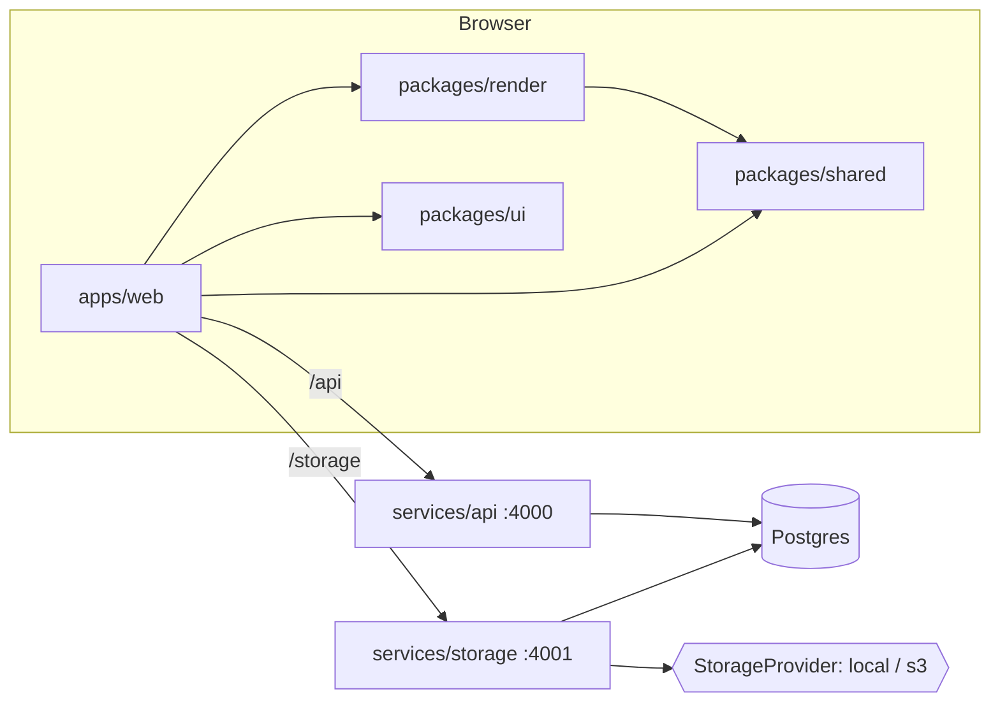

# memegen — architecture

Online meme generator: upload media, overlay (optionally animated) text, publish to a voted gallery.

## Components

```
apps/web            React + Vite SPA: editor, templates, gallery, profiles      (component 3 + 4 UI)
packages/ui         Skinnable React components + design tokens (default/apple/material/google/spectrum)
packages/render     Browser render engine: decode → composite → encode (TS)   (component 2)
packages/shared     Types, zod schemas, upload limits, animation + text layout (used everywhere)
packages/server-kit Node server plumbing: config, Postgres, migrations, auth, http helpers
services/storage    Asset service: pluggable providers (local, s3), probing, caps (component 1)
services/api        Gallery/templates/memes/votes/users/stats                    (component 4)
db/migrations       Plain SQL migrations, applied in filename order
scripts/            dev runner, seed/import
e2e/                Playwright browser specs + fixtures (isolated DB/ports)
```



## Decisions

### Rendering happens in the browser
- Requirement: do as much processing as possible client-side in TS. The server stores, validates, and indexes; it never decodes or encodes frames.
- `packages/render` decodes sources to frames, draws text layers on canvas, and encodes output:
  - image → canvas → PNG/JPEG
  - GIF → `gifuct-js` decode (with disposal compositing) → `gifenc` encode, original per-frame delays preserved
  - MP4/MOV → `mediabunny` (WebCodecs) demux/decode, per-frame canvas composite, H.264 MP4 encode; audio is passed through
- The editor preview and the exporter call the same `layoutText`/`drawText` (`packages/shared/src/text.ts`), so preview == output.
- Trade-off: export speed depends on the client device and WebCodecs support (Chromium, Safari 17+ / Firefox 130+). A server-side fallback can reuse the same TS code later (e.g. node canvas) without changing the data model.

### Text model (ideas taken from jacebrowning/memegen)
- A `TextLayer` is a box: center anchor `x,y` + `maxWidth,maxHeight` as fractions of the media size. `fontSize` is a *max*; text wraps at the box width and shrinks until it fits (jacebrowning's fit-to-box behavior).
- `textStyle`: `upper | lower | none | mock` (deterministic sPoNgEbOb casing).
- `angle` rotates the box around its center.
- Stroke width is a fraction of font size, so it scales with the media.
- Everything is resolution-independent (fractions of width/height), so the editor can preview at any zoom.

### Animation
- Per-layer visibility window `start/end` (seconds, null = unbounded).
- Per-layer `keyframes[] {t, x, y, opacity}`; linear interpolation, clamped at the ends (`packages/shared/src/animation.ts`). Empty keyframes = fixed layer.
- The editor shows every decoded frame on a timeline; "set keyframe" stores the current frame's timestamp, which is how per-frame placement works.

### Storage (component 1)
- `StorageProvider` interface (`put/get/getRange/delete/exists`) with a registry keyed by name. Built-ins: `local` (filesystem) and `s3` (AWS SDK v3, works with any S3-compatible endpoint). New providers register a factory; no other code changes.
- Each asset row records its `provider` + `storage_key`, so several providers can coexist and the default (`STORAGE_PROVIDER`) can change without migrating old files.
- Asset kinds: `image | gif | video | font`. Content type is sniffed from magic bytes, not trusted from the client.
- Content is served with HTTP Range support (video scrubbing).

### Upload caps
Enforced server-side on every upload (client pre-checks with the same `limitViolations` from `packages/shared`). Defaults, env-overridable:

| kind  | max longest edge | max frames | env |
|-------|------------------|------------|-----|
| any   | 20 MB file size  | —          | `MAX_UPLOAD_BYTES` |
| image | 4096 px          | —          | `MAX_IMAGE_DIMENSION` |
| gif   | 1024 px          | 500        | `MAX_GIF_DIMENSION`, `MAX_GIF_FRAMES` |
| video | 1920 px          | 1800       | `MAX_VIDEO_DIMENSION`, `MAX_VIDEO_FRAMES` |

Probing is pure JS (no ffmpeg on the server): `image-size` for still images, a GIF block walker for frame count/duration, `mediabunny` for MP4/MOV dimensions, duration, and frame count.
Rendered outputs go through the same caps, so an export over 20 MB is rejected.

### Templates
- `templates` with a nullable `parent_id`: exactly one level of hierarchy (template → variations). A DB trigger rejects a variation whose parent is itself a variation, and rejects giving a parent to a template that already has variations.
- Templates carry `default_layers` (text box presets) that seed the editor.
- `scripts/seed.ts --from <jacebrowning/memegen clone>` imports its fonts and ~200 templates. `default.*` becomes the parent; other images in the folder become variations.

### Template usage ("hot" templates)
- Core tables: `users`, `memes` (one row per meme, with its own vote tallies), `templates` (+ variations), `votes`, `assets`.
- `template_uses` is an append-only event log: a `created` row when a meme is made from a template, a `posted` row when it is posted. Each row stores the exact template and its `root_template_id` (the parent for variations), so a variation's usage also counts toward its parent.
- Written by a trigger on `memes`, so every write path records usage. `meme_id` is `on delete set null`: history survives meme deletion and still feeds "hot over time".
- Hot ranking = `created` uses inside the period (tie-break: posts). `Template.useCount` is the all-time count; `/usage` gives a time series for charts.

### Tags
- `tags(slug unique, name, kind topic|team, description)` + join tables `template_tags`, `meme_tags`. Built-in topics: `oldschool` (all seeded jacebrowning templates), `movie` (screenshots). `team` tags mark an org's own memes (e.g. `google-memes`) when deployed internally.
- Names normalize to slugs (`"Google Memes!"` → `google-memes`, `tagSlug` in shared). Tagging with an unknown slug creates a `topic` tag; `POST /api/tags` creates one explicitly (e.g. with `kind: team`).
- Inheritance (SQL views): `template_tag_matches` rolls variation tags up to the parent; `meme_tag_matches` matches a meme by its own tags **or** its template's/parent's tags. Tagging a template `movie` surfaces every meme made from it. `Template.tags`/`Meme.tags` show only directly placed tags.
- Retagging: meme owner; template owner; ownerless (seeded) templates can be tagged by any signed-in user (community curation).

### Memes, posting, visibility
- A meme stores the source asset, the client-rendered output asset, and the `layers` used, so it can be re-edited.
- Saved = row exists (`posted_at` null). Posted = `posted_at` set. `visibility` is `public` (default) or `private`.
- Gallery and public profiles list memes that are posted **and** public. Private memes are visible only to their owner and can't be voted on.

### Votes, ranking, stats
- `votes(user_id, meme_id, value ±1)`, one per user per meme. A trigger keeps `memes.upvotes/downvotes` up to date; `score` is a generated column.
- Gallery `best` = posted public memes with `posted_at` inside the period (day/week/month/year/all), ordered by score, then recency. `new` = recency.
- User stats are computed over posted memes:
  - `memeCount`
  - `highScore`: max score
  - `hScore`: largest h such that h memes have score ≥ h
  - `negativeHScore` (internal only): largest h such that h memes have score ≤ −h. Exposed only at `/internal/users/:username/stats` on the API port, behind `X-Internal-Token`; the web proxy does not forward `/internal`.

### Auth (placeholder)
- No passwords yet. `POST /api/session {username}` finds or creates the user; the client sends `X-User-Id` on requests.
- Behind an `AuthProvider` interface (`packages/server-kit/src/auth.ts`); a real provider (OAuth/session) replaces `HeaderAuthProvider` without touching route code.
- **Not secure**: anyone can act as anyone. Fine for local development only.

### UI skins (`packages/ui`)
- All web UI goes through `@memegen/ui`: typed React components that extend native element props and render native controls (`<select>`, `<input type=file|range|color>`), so platform behavior, a11y and automation work identically in every skin.
- A skin is `data-skin="<id>"` on `<html>` plus CSS: `tokens.css` holds the default (dark) token set on `:root`; `skins/<id>.css` overrides tokens and adds component tweaks under `:root[data-skin="<id>"]`. Components and `apps/web/src/styles.css` read only tokens (no hard-coded colors).
- Built-ins: `default`, `apple` (HIG), `material` (M3), `google` (2012 internal Memegen / Kennedy), `spectrum` (Spectrum 2 / Firefly). Light-first skins follow `prefers-color-scheme`.
- Choice: `?skin=` → `localStorage["memegen.skin"]` → `default`; `SkinProvider` persists changes and the header's `skin-select` switches.
- Skins can replace any component (`Skin.components`, typed by `ComponentOverrides`) and give layout hints (`Skin.layout`: tag search in sidebar or header, sort/period in sidebar or beside the title, a primary "Create meme" button atop the sidebar). Hints move controls; they never duplicate them, so test ids stay unique.
- Trade-off: hints mean the app branches on skin in a few places; in exchange CSS-only skins can still look structurally like their design systems.

### Testing
- `node --test` (`bun run test`): pure logic in `packages/shared` (interpolation, limits, fit-to-box layout) plus storage/API behavior through `app.request()` against a fresh `memegen_test` schema (caps, ranges, stats, hierarchy, visibility, votes, usage, tags).
- Playwright (`bun run test:e2e`): full browser flows against real servers on separate ports and a fresh `memegen_e2e` DB. Exported files are checked with `ffprobe` (frame counts, audio passthrough). Uses branded Chrome, since Playwright's Chromium lacks H.264/AAC for WebCodecs.
- Mock dataset (`scripts/mock/data.ts` + `seed.ts`): deterministic users, templates, memes backdated across periods, and votes, with expected stats and orderings exported for specs. `./run.sh config/dev.env seed` loads it into dev (`SEED_MOCK=true`; refused in prod); e2e setup loads it into `memegen_e2e`. Media is generated in code.
- Each e2e spec runs once per skin (one Playwright project per skin). Identities are suffixed per project (`scoped()`), and vote assertions are relative to what's shown, so all projects share one seeded DB.
- The UI exposes `data-testid` hooks plus readiness markers (`stage-canvas[data-ready]`, `timeline[data-complete]`), so specs wait on state rather than sleeps.
- Vite pre-bundles the linked render package's deps (`optimizeDeps.include`); otherwise the first editor load triggers a dep re-optimization reload.

### Runtime and tooling
- Servers: Node ≥ 23.6 running `.ts` directly (type stripping; erasable syntax only), Hono + `@hono/node-server`, `postgres` (porsager) client.
- Bun is the package manager/script runner/builder (`bun install`, `bun run …`); Vite builds the web app.
- Postgres for metadata; local disk (`.data/storage`) for files by default.

### Running and configuration
- `run.sh <config> <command>` is the single entry point. A config is a plain `KEY=value` file. `run.sh` exports it literally (no shell expansion), and Node's `--env-file` reads the same format as a fallback.
- `config/dev.env` is committed with no secrets. `config/prod.env` is gitignored and copied from `config/prod.env.example`.
- `MODE=prod` guards:
  - mock seeding, `dev`, `test`, and `e2e` are refused
  - `INTERNAL_TOKEN` must be set and not the dev value
  - placeholder `DATABASE_URL`s are rejected
  - masked values only in `config` output
- `start` serves the built SPA with `scripts/serve-web.ts`, a dependency-free Node server:
  - SPA fallback; immutable caching for `assets/`
  - proxies `/api` and `/storage` exactly like the Vite dev proxy; `/internal` is never proxied
- `run.sh` supervises storage, API, and web as a group: if any process exits, the rest stop and `run.sh` returns its status. It is bash 3.2-compatible (macOS default).
- **UI skins**: see `packages/ui/README.md`. Components read design tokens, and `<html data-skin>` selects default/apple/material/google/spectrum; a skin can also replace whole components.

## Service contracts

All JSON. Errors: `{ error: string, details?: string[] }` with 4xx/5xx (validation issues or cap violations, human-readable).

### storage (`:4001`, web proxy `/storage`)
| method | path | notes |
|---|---|---|
| GET | `/limits` | `UploadLimits` |
| GET | `/providers` | `{ default, available[] }` |
| POST | `/assets` | multipart `file`, optional `name`; `X-User-Id` sets owner. 201 `Asset`; 413/422 `{error, details: violations[]}` |
| GET | `/assets?kind=&offset=&limit=` | `Page<Asset>` (fonts sorted by name; the editor's font list) |
| GET | `/assets/:id` | `Asset` |
| GET | `/assets/:id/content` | file bytes, Range supported, immutable cache |
| DELETE | `/assets/:id` | owner or internal token; 409 if referenced |

### api (`:4000`, web proxy `/api`)
| method | path | notes |
|---|---|---|
| POST | `/api/session` | `{username}` → `{user}` (find or create) |
| GET | `/api/me` | `{user, stats}`; 401 without user |
| GET | `/api/users/:username` | `{user, stats}` (public stats) |
| GET | `/api/users/:username/memes` | `Page<Meme>`; the owner also sees drafts/private |
| GET | `/api/templates?q=&tag=&offset=&limit=` | `Page<Template>` (top-level, variations nested) |
| GET | `/api/templates/hot?period=&limit=` | `HotTemplate[]` — most-used top-level templates in the period |
| GET | `/api/templates/:id/usage?period=` | `TemplateUsage` — zero-filled series (day→hourly, week/month→daily, year/all→monthly) |
| GET | `/api/templates/:id` | `Template` (+ variations, `useCount`) |
| POST | `/api/templates` | `{name, assetId, parentId?, defaultLayers?, isPublic?, tags?}` |
| PATCH/DELETE | `/api/templates/:id` | owner only |
| POST | `/api/memes` | `{title, templateId XOR sourceAssetId, outputAssetId, layers, visibility, post, tags?}` |
| GET | `/api/memes/:id` | `Meme` (private → owner only) |
| PATCH | `/api/memes/:id` | `{title?, visibility?, tags?, layers+outputAssetId?}` owner only |
| POST | `/api/memes/:id/post` | sets `posted_at` |
| DELETE | `/api/memes/:id` | owner only |
| PUT | `/api/memes/:id/vote` | `{value: -1|0|1}` → `Meme` |
| GET | `/api/gallery?period=&sort=&tag=&offset=&limit=` | `Page<Meme>` |
| GET | `/api/tags?q=&kind=&limit=` | `Tag[]` with `templateCount`/`memeCount`, most used first |
| GET | `/api/tags/:slug` | `Tag` |
| POST | `/api/tags` | `{name, kind?, description?}` → 201 `Tag`; 409 if slug exists |
| PUT | `/api/templates/:id/tags` | `{tags: string[]}` replace (owner, or anyone for ownerless templates) |
| GET | `/internal/users/:username/stats` | `InternalUserStats`, `X-Internal-Token` |
