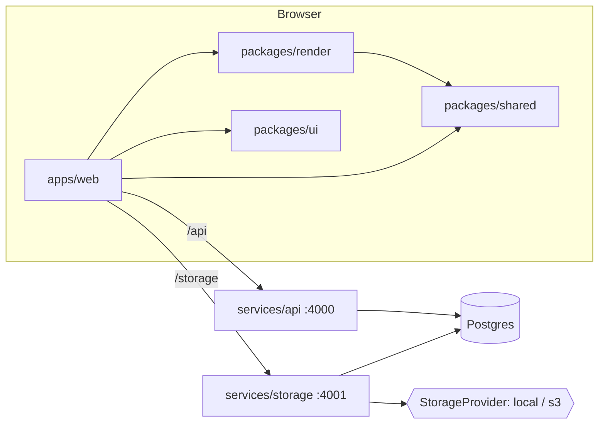

# memegen — architecture

Online meme generator: pick a template (or add one), overlay (optionally animated) text, publish to a voted gallery.

## Components

```
apps/web            React + Vite SPA: editor, templates, gallery, profiles      (component 3 + 4 UI)
packages/ui         Skinnable React components + design tokens (default/apple/matte/google/studio/spectrum)
packages/render     Browser render engine: decode → composite → encode (TS)   (component 2)
packages/shared     Types, zod schemas, upload limits, animation + text layout (used everywhere)
packages/server-kit Node server plumbing: config, Postgres, migrations, auth, http helpers
services/storage    Asset service: pluggable providers (local, s3), probing, caps (component 1)
services/api        Gallery/templates/memes/votes/users/stats                    (component 4)
db/migrations       Plain SQL migrations, applied in filename order
scripts/            dev runner, seed/import
e2e/                Playwright browser specs + fixtures (isolated DB/ports)
```



## Decisions

### Rendering happens in the browser
- Requirement: do as much processing as possible client-side in TS. The server stores, validates, and indexes; it never decodes or encodes frames.
- `packages/render` decodes sources to frames, draws text layers on canvas, and encodes output:
  - image → canvas → PNG/JPEG
  - GIF → `gifuct-js` decode (with disposal compositing) → `gifenc` encode, original per-frame delays preserved. Delays under 20 ms play as 100 ms like in browsers; render and storage's duration math share `gifFrameDelayMs` from `packages/shared`.
  - MP4/MOV → `mediabunny` (WebCodecs) demux/decode, per-frame canvas composite, H.264 MP4 encode; audio is passed through
- The editor preview and the exporter call the same `layoutText`/`drawText` (`packages/shared/src/text.ts`), so preview == output. `composeFrame` lays each layer out once and returns its `LayerBox`es (one per visible layer, even transparent/empty ones), which the editor uses for hit-testing.
- Resolution: text is rasterized at the size it is shown or saved, never at the source's pixel size and then stretched (templates are often 250–700 px). The editor canvas's backing store is its CSS size × `devicePixelRatio`; still exports render at least `STILL_EXPORT_MIN_EDGE` (1200 px) on the long edge, capped by the image upload cap (`stillExportSize`), with the source image upscaled at high smoothing quality. Layout is in fractions, so every size draws the same composition; only the min-font clamp (`MIN_FONT_PX`) can differ for overflowing text. GIFs and videos export at native size (frame and file-size caps).
- Trade-off: export speed depends on the client device and WebCodecs support (Chromium, Safari 17+ / Firefox 130+). A server-side fallback can reuse the same TS code later (e.g. node canvas) without changing the data model.

### Text model (ideas taken from jacebrowning/memegen)
- A `TextLayer` is a box: center anchor `x,y` + `maxWidth,maxHeight` as fractions of the media size. `fontSize` is a *max*; text wraps at the box width and shrinks until it fits (jacebrowning's fit-to-box behavior). The `TextLayer`/`Keyframe` types are derived from their zod schemas (`z.output`), so the API boundary and the editor cannot drift.
- `textStyle`: `upper | lower | none | mock` (deterministic sPoNgEbOb casing).
- `angle` rotates the box around its center.
- Stroke width is a fraction of font size, so it scales with the media.
- Everything is resolution-independent (fractions of width/height), so the editor can preview at any zoom.

### Animation
- Per-layer visibility window `start/end` (seconds, null = unbounded).
- Per-layer `keyframes[] {t, x, y, opacity}`; linear interpolation, clamped at the ends (`packages/shared/src/animation.ts`). Empty keyframes = fixed layer.
- The editor shows every decoded frame on a timeline; "set keyframe" stores the current frame's timestamp, which is how per-frame placement works.

### Storage (component 1)
- `StorageProvider` interface (`put/get/getRange/delete/exists`) with a registry keyed by name. Built-ins: `local` (filesystem) and `s3` (AWS SDK v3, works with any S3-compatible endpoint). New providers register a factory; no other code changes.
- Each asset row records its `provider` + `storage_key`, so several providers can coexist and the default (`STORAGE_PROVIDER`) can change without migrating old files.
- Asset kinds: `image | gif | video | font`. Content type is sniffed from magic bytes, not trusted from the client.
- Content is served with HTTP Range support (video scrubbing).

### Upload caps
Enforced server-side on every upload (client pre-checks with the same `limitViolations` from `packages/shared`). Defaults, env-overridable:

| kind  | max longest edge | max frames | env |
|-------|------------------|------------|-----|
| any   | 20 MB file size  | —          | `MAX_UPLOAD_BYTES` |
| image | 4096 px          | —          | `MAX_IMAGE_DIMENSION` |
| gif   | 1024 px          | 500        | `MAX_GIF_DIMENSION`, `MAX_GIF_FRAMES` |
| video | 1920 px          | 1800       | `MAX_VIDEO_DIMENSION`, `MAX_VIDEO_FRAMES` |

Probing is pure JS (no ffmpeg on the server): `image-size` for still images, a GIF block walker for frame count/duration, `mediabunny` for MP4/MOV dimensions, duration, and frame count.
Rendered outputs go through the same caps, so an export over 20 MB is rejected.

### Templates
- `templates` with a nullable `parent_id`: exactly one level of hierarchy (template → variations). A DB trigger rejects a variation whose parent is itself a variation, and rejects giving a parent to a template that already has variations.
- Templates carry `default_layers` (text box presets) that seed the editor.
- Every template has an author (`owner_id not null`, shown as "added by"). Built-in templates belong to the reserved `memegen` account: a trigger fills a null owner with `memegen_user_id()` (created lazily, so seeds and `on delete set null` keep working), and `sessionSchema` refuses `memegen` as a login name, so nobody can act as it or edit its templates.
- `scripts/seed.ts --from <jacebrowning/memegen clone>` imports its fonts and ~200 templates. `default.*` becomes the parent; other images in the folder become variations.
- The template browser lives on `/create`; there is no separate templates page. The start view puts hot templates beside the "New template" card (the only way to bring in new media), with all templates and their search below. The template grid loads the next page when an IntersectionObserver sentinel nears the viewport; the sentinel re-arms after each page, so short pages keep loading. The grid's `data-query` names the search it shows, since the search is debounced.
- Adding a template: the file is pre-checked and uploaded, then the main editor opens as the "Template Editor" (`/create?newTemplate=<assetId>`) with TOP TEXT / BOTTOM TEXT boxes placed. The user edits boxes like any meme, names and tags it, and Save template asks "Add new template?" (`Dialog` in `@memegen/ui`, a native `<dialog>`) before `POST /api/templates` with the placed boxes as `defaultLayers` and the tags as base tags; the new template then opens in the editor. Abandoning the editor leaves the uploaded asset unused.
- Template cards (all templates, tag pages) show only the image, name, author, use count (`n🔥`), and Use. Opening a template in the editor shows its details under the stage: tags (base tags marked; any signed-in user can add more), the usage chart, and its variations. Variations are created through the API (`POST /api/templates` with `parentId`); the UI has no upload for them.

### Template usage ("hot" templates)
- Core tables: `users`, `memes` (one row per meme, with its own vote tallies), `templates` (+ variations), `votes`, `assets`.
- `template_uses` is an append-only event log: a `created` row when a meme is made from a template, a `posted` row when it is posted. Each row stores the exact template and its `root_template_id` (the parent for variations), so a variation's usage also counts toward its parent.
- Written by a trigger on `memes`, so every write path records usage. `meme_id` is `on delete set null`: history survives meme deletion and still feeds "hot over time".
- Hot ranking = `created` uses inside the period (tie-break: posts). `Template.useCount` is the all-time count; `/usage` gives a time series for charts.

### Tags
- `tags(slug unique, name, kind topic|team, description)` + join tables `template_tags`, `meme_tags`. Built-in topics: `oldschool` (all seeded jacebrowning templates), `movie` (screenshots). `team` tags mark an org's own memes (e.g. `google-memes`) when deployed internally.
- Names normalize to slugs (`"Google Memes!"` → `google-memes`, `tagSlug` in shared). Tagging with an unknown slug creates a `topic` tag; `POST /api/tags` creates one explicitly (e.g. with `kind: team`). In the UI new tags are made while authoring a meme (editor save panel), not from the main page.
- Inheritance (SQL views): `template_tag_matches` rolls variation tags up to the parent; `meme_tag_matches` matches a meme by its own tags **or** its template's/parent's tags. Tagging a template `movie` surfaces every meme made from it. `Template.tags`/`Meme.tags` show only directly placed tags.
- Template tags are base or added (`template_tags.base`, `added_by`). Base tags come with the template (author's tags at creation, seed tags) and are never removed through the API. Any signed-in user can add tags (`POST /api/templates/:id/tags`); additions never touch base tags. `Template.baseTags ⊆ Template.tags`.
- Trade-off: there is no removal path for added tags yet (no moderation); a mistaken tag stays until removed in SQL.
- Meme tags: the meme owner sets them.

### Memes, posting, visibility
- Every meme is made from a template (`memes.template_id not null`, FK `on delete restrict`; `POST /api/memes` takes `templateId` only). There is no one-off upload: new media becomes a template first. Migration 006 gave earlier one-off memes a private template built from their own source image, owned by their author.
- A meme stores its template, the source asset (the template's media at creation), the client-rendered output asset, and the `layers` used, so it can be re-edited.
- Saved = row exists (`posted_at` null). Posted = `posted_at` set. `visibility` is `public` (default) or `private`.
- Gallery and public profiles list memes that are posted **and** public. Private memes are visible only to their owner and can't be voted on.
- Meme grids show media at native aspect, never cropped: every image is one row tall (0.8 × `--ui-grid-min`), and a meme spans `round(aspect × 0.8)` columns, 1 to 3, clamped to the columns the grid has (computed from its width and tokens, not its rendered tracks, which a spanning card inflates). `grid-auto-flow: dense` backfills gaps, so a later narrow meme can sit beside an earlier wide one. Masonry skins ignore spans.
- Grid cards shrink to their image; title, author, tags, votes, star and comment count sit on a scrim (`--ui-color-scrim` / `--ui-color-on-scrim`, dark in every skin) that fades in from the bottom and slides up on hover or keyboard focus. Devices without hover (`@media (hover: none)`) always show it. The overlay stays in the DOM (opacity, not `display`), so it remains reachable by keyboard and automation.

### Votes, ranking, stats
- `votes(user_id, meme_id, value ±1, created_at)`, one per user per meme. A trigger keeps `memes.upvotes/downvotes` up to date; `score` is a generated column.
- Votes double as per-user activity (no separate store): `GET /api/me/activity` lists every meme the viewer voted on, likes and dislikes together (`myVote` says which), newest vote first (`votes_user_time` index; changing a vote refreshes `created_at`, clearing it deletes the row). Only the owner sees it: the profile's "Recent activity" tab.
- Favorites are separate from votes: `favorites(user_id, meme_id, created_at)`; the ☆/★ button stars other users' posted public memes (`Meme.favorited` is per viewer). `GET /api/me/favorites` backs the owner-only profile "Favorites" tab, most recently starred first. Profile tabs: Memes, Favorites, Recent activity.
- Gallery: Popular (`/`, `best`) = posted public memes with `posted_at` inside the period (day/week/month/year/all), ordered by score, then recency. Recent (`/recent`, `new`) = all-time recency. Tag pages keep both sorts.
- User stats are computed over posted memes:
  - `memeCount`
  - `highScore`: max score
  - `hScore`: largest h such that h memes have score ≥ h
  - `negativeHScore` (internal only): largest h such that h memes have score ≤ −h. Exposed only at `/internal/users/:username/stats` on the API port, behind `X-Internal-Token`; the web proxy does not forward `/internal`.
- One SQL definition of the stats serves profiles and the leaderboard (`/api/leaderboard?by=hScore|highScore|memeCount`, users with ≥ 1 posted meme).

### Badges
- Config in `packages/shared/src/badges.ts`: each badge has an emoji `icon`, a label, and `show(stats)`. Profiles render `badgesFor(stats)`; adding a badge is one config entry, no API change.
- Tiers bronze 🥉 / silver 🥈 / gold 🥇 / platinum 🏆 / diamond 💎 for memes posted (3/10/25/50/100), high score (10/25/50/100/250), and h-score (2/5/10/20/30). A tier shows while the stat is in [its threshold, the next tier's), so each stat shows only its highest tier.
- Computed client-side from public stats, so badges can never leak internal stats.

### Comments
- `comments(meme_id, parent_id, author_id, body, deleted_at)`: top-level comments plus one level of replies (a trigger requires a reply's parent to be a top-level comment on the same meme), like Google Memegen's per-meme discussion.
- Only posted public memes take comments (same rule as votes); reading follows meme visibility.
- Deleting a comment that has replies blanks it (`deleted_at`, returned as `deleted: true`, empty body) so the thread keeps its shape; otherwise the row goes, and a blanked parent left without replies goes with it. `Meme.commentCount` counts non-deleted comments.

### Auth (placeholder)
- No passwords yet. `POST /api/session {username}` finds or creates the user; the client sends `X-User-Id` on requests.
- Behind an `AuthProvider` interface (`packages/server-kit/src/auth.ts`); a real provider (OAuth/session) replaces `HeaderAuthProvider` without touching route code.
- **Not secure**: anyone can act as anyone. Fine for local development only.

### UI skins (`packages/ui`)
- All web UI goes through `@memegen/ui`: typed React components that extend native element props and render native controls (`<select>`, `<input type=file|range|color>`), so platform behavior, a11y and automation work identically in every skin.
- A skin is `data-skin="<id>"` on `<html>` plus CSS: `tokens.css` holds the default (dark) token set on `:root`; `skins/<id>.css` overrides tokens and adds component tweaks under `:root[data-skin="<id>"]`. Components and `apps/web/src/styles.css` read only tokens (no hard-coded colors).
- Built-ins: `default`, `apple` (HIG, light only), `matte` (M3-inspired), `google` (2012 internal Memegen / Kennedy), `studio` (a light creative-studio look; formerly called "spectrum" though it used none of Spectrum's CSS), `spectrum` (real Spectrum 2 via `@spectrum-css/tokens`, styled like Firefly, dark). `matte` and `studio` follow `prefers-color-scheme`.
- `Skin.rootClassName` adds classes to `<html>` while a skin is active, for design-system CSS that scopes tokens to classes (Spectrum's `.spectrum--dark` etc.), so those tokens never reach other skins.
- Adobe Clean (Spectrum's typeface) is licensed through Adobe Fonts only, so it is never bundled or hot-linked; the `spectrum` stack uses it when installed and otherwise the bundled Source Sans 3 (OFL), Spectrum's documented fallback.
- The favicon follows the skin: `useSkinFavicon` draws the wordmark's first letter on a canvas (canvas, not SVG, so it can use the page's web fonts) in the skin's wordmark font, case, and color or gradient over its page background, and swaps the `<link rel="icon">` on every skin change. `apps/web/public/favicon.svg` covers the first paint.
- Choice: `?skin=` → `localStorage["memegen.skin"]` → `default`; `SkinProvider` persists changes and the header's `skin-select` switches.
- Skins can replace any component (`Skin.components`, typed by `ComponentOverrides`) and give layout hints (`Skin.layout`: tag search in sidebar or header, sort/period in sidebar or beside the title, a primary "Create meme" button atop the sidebar). Hints move controls; they never duplicate them, so test ids stay unique.
- Trade-off: hints mean the app branches on skin in a few places; in exchange CSS-only skins can still look structurally like their design systems.

### Testing
- `node --test` (`bun run test`): pure logic in `packages/shared` (interpolation, limits, fit-to-box layout) plus storage/API behavior through `app.request()` against a fresh `memegen_test` schema (caps, ranges, stats, hierarchy, visibility, votes, usage, tags).
- Playwright (`bun run test:e2e`): full browser flows against real servers on separate ports and a fresh `memegen_e2e` DB. Exported files are checked with `ffprobe` (frame counts, audio passthrough). Uses branded Chrome, since Playwright's Chromium lacks H.264/AAC for WebCodecs.
- Mock dataset (`scripts/mock/data.ts` + `seed.ts`): deterministic users, templates, memes backdated across periods, and votes, with expected stats and orderings exported for specs. `./run.sh config/dev.env seed` loads it into dev (`SEED_MOCK=true`; refused in prod); e2e setup loads it into `memegen_e2e`. Media is generated in code.
- Each e2e spec runs once per skin (one Playwright project per skin). Identities are suffixed per project (`scoped()`), and vote assertions are relative to what's shown, so all projects share one seeded DB.
- The UI exposes `data-testid` hooks plus readiness markers (`stage-canvas[data-ready]`, `timeline[data-complete]`), so specs wait on state rather than sleeps.
- Vite pre-bundles the linked render package's deps (`optimizeDeps.include`); otherwise the first editor load triggers a dep re-optimization reload.

### Runtime and tooling
- Servers: Node ≥ 23.6 running `.ts` directly (type stripping; erasable syntax only), Hono + `@hono/node-server`, `postgres` (porsager) client.
- Bun is the package manager/script runner/builder (`bun install`, `bun run …`); Vite builds the web app.
- Postgres for metadata; local disk (`.data/storage`) for files by default.

### Running and configuration
- `run.sh <config> <command>` is the single entry point. A config is a plain `KEY=value` file. `run.sh` exports it literally (no shell expansion), and Node's `--env-file` reads the same format as a fallback.
- `config/dev.env` is committed with no secrets. `config/prod.env` is gitignored and copied from `config/prod.env.example`.
- `MODE=prod` guards:
  - mock seeding, `dev`, `test`, and `e2e` are refused
  - `INTERNAL_TOKEN` must be set and not the dev value
  - placeholder `DATABASE_URL`s are rejected
  - masked values only in `config` output
- `start` serves the built SPA with `scripts/serve-web.ts`, a dependency-free Node server:
  - SPA fallback; immutable caching for `assets/`
  - proxies `/api` and `/storage` exactly like the Vite dev proxy; `/internal` is never proxied
- `run.sh` supervises storage, API, and web as a group: if any process exits, the rest stop and `run.sh` returns its status. It is bash 3.2-compatible (macOS default).
- **UI skins**: see `packages/ui/README.md`. Components read design tokens, and `<html data-skin>` selects default/apple/matte/google/studio/spectrum; a skin can also replace whole components.

## Service contracts

All JSON. Errors: `{ error: string, details?: string[] }` with 4xx/5xx (validation issues or cap violations, human-readable).

### storage (`:4001`, web proxy `/storage`)
| method | path | notes |
|---|---|---|
| GET | `/limits` | `UploadLimits` |
| GET | `/providers` | `{ default, available[] }` |
| POST | `/assets` | multipart `file`, optional `name`; `X-User-Id` sets owner. 201 `Asset`; 413/422 `{error, details: violations[]}` |
| GET | `/assets?kind=&offset=&limit=` | `Page<Asset>` (fonts sorted by name; the editor's font list) |
| GET | `/assets/:id` | `Asset` |
| GET | `/assets/:id/content` | file bytes, Range supported, immutable cache |
| DELETE | `/assets/:id` | owner or internal token; 409 if referenced |

### api (`:4000`, web proxy `/api`)
| method | path | notes |
|---|---|---|
| POST | `/api/session` | `{username}` → `{user}` (find or create); reserved names (`memegen`) → 400 |
| GET | `/api/me` | `UserProfile` `{user, stats, templateCount}`; 401 without user |
| GET | `/api/me/activity?offset=&limit=` | `Page<Meme>` the viewer voted on (either way), newest vote first; 401 without user |
| GET | `/api/me/favorites?offset=&limit=` | `Page<Meme>` the viewer starred, newest first; 401 without user |
| GET | `/api/leaderboard?by=hScore\|highScore\|memeCount&limit=` | `LeaderboardEntry[]` `{rank, user, stats}` |
| GET | `/api/users/:username` | `UserProfile` (public stats; `templateCount` = public templates the user added, variations included) |
| GET | `/api/users/:username/memes` | `Page<Meme>`; the owner also sees drafts/private |
| GET | `/api/templates?q=&tag=&offset=&limit=` | `Page<Template>` (top-level, variations nested; `owner` always set, `baseTags ⊆ tags`) |
| GET | `/api/templates/hot?period=&limit=` | `HotTemplate[]` — most-used top-level templates in the period |
| GET | `/api/templates/:id/usage?period=` | `TemplateUsage` — zero-filled series (day→hourly, week/month→daily, year/all→monthly) |
| GET | `/api/templates/:id` | `Template` (+ variations, `useCount`) |
| POST | `/api/templates` | `{name, assetId, parentId?, defaultLayers?, isPublic?, tags?}`; `tags` become base tags |
| PATCH/DELETE | `/api/templates/:id` | owner only; DELETE → 409 while memes use it (or one of its variations) |
| POST | `/api/memes` | `{title, templateId, outputAssetId, layers, visibility, post, tags?}`; every meme is made from a template |
| GET | `/api/memes/:id` | `Meme` (private → owner only) |
| PATCH | `/api/memes/:id` | `{title?, visibility?, tags?, layers+outputAssetId?}` owner only |
| POST | `/api/memes/:id/post` | sets `posted_at` |
| DELETE | `/api/memes/:id` | owner only |
| PUT | `/api/memes/:id/vote` | `{value: -1|0|1}` → `Meme` |
| PUT | `/api/memes/:id/favorite` | `{favorite: boolean}` → `Meme`; posted public memes only; idempotent |
| GET | `/api/memes/:id/comments?offset=&limit=` | `Page<Comment>`: top-level oldest first, replies nested |
| POST | `/api/memes/:id/comments` | `{body, parentId?}` → 201 `Comment`; posted public memes only |
| DELETE | `/api/comments/:id` | author only; blanked if it has replies, else removed |
| GET | `/api/gallery?period=&sort=&tag=&offset=&limit=` | `Page<Meme>` |
| GET | `/api/tags?q=&kind=&limit=` | `Tag[]` with `templateCount`/`memeCount`, most used first |
| GET | `/api/tags/:slug` | `Tag` |
| POST | `/api/tags` | `{name, kind?, description?}` → 201 `Tag`; 409 if slug exists |
| POST | `/api/templates/:id/tags` | `{tags: string[]}` adds non-base tags (any signed-in user) → `Template` |
| GET | `/internal/users/:username/stats` | `InternalUserStats`, `X-Internal-Token` |
